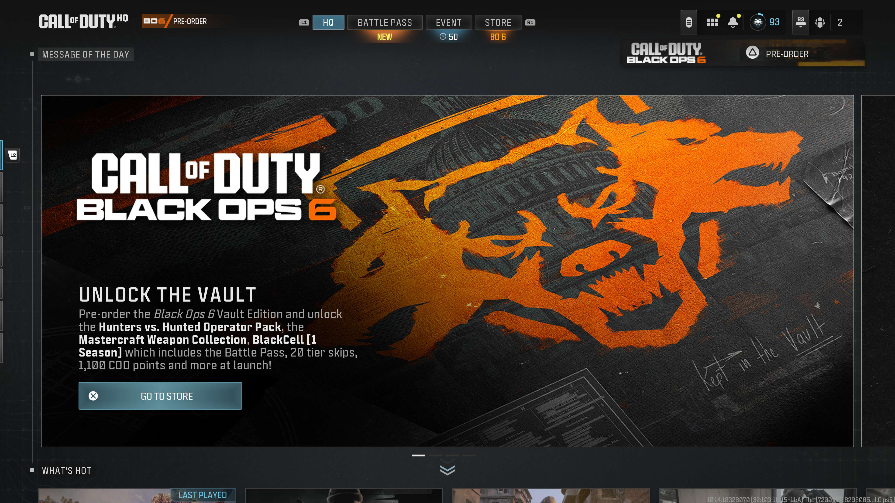
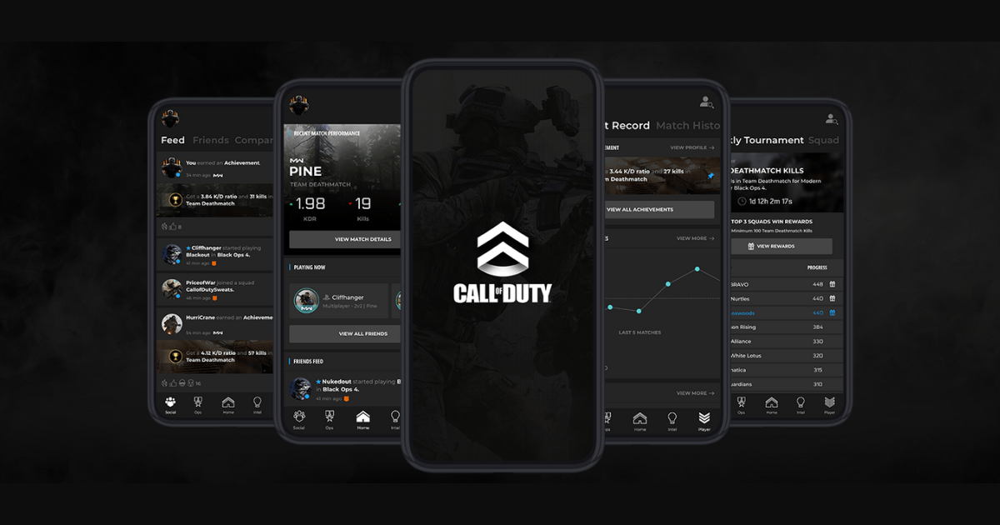
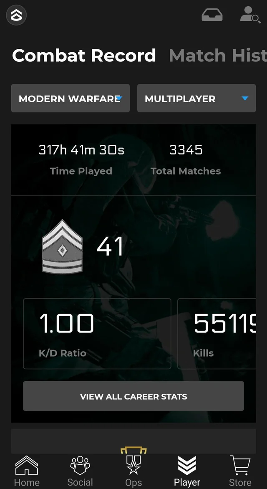
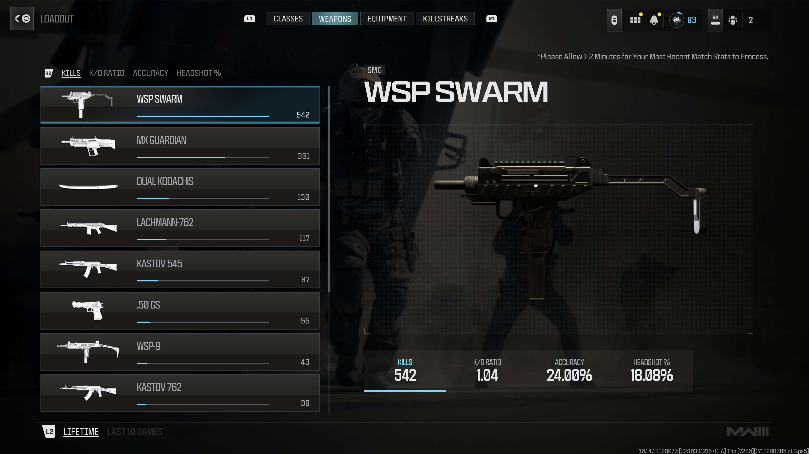
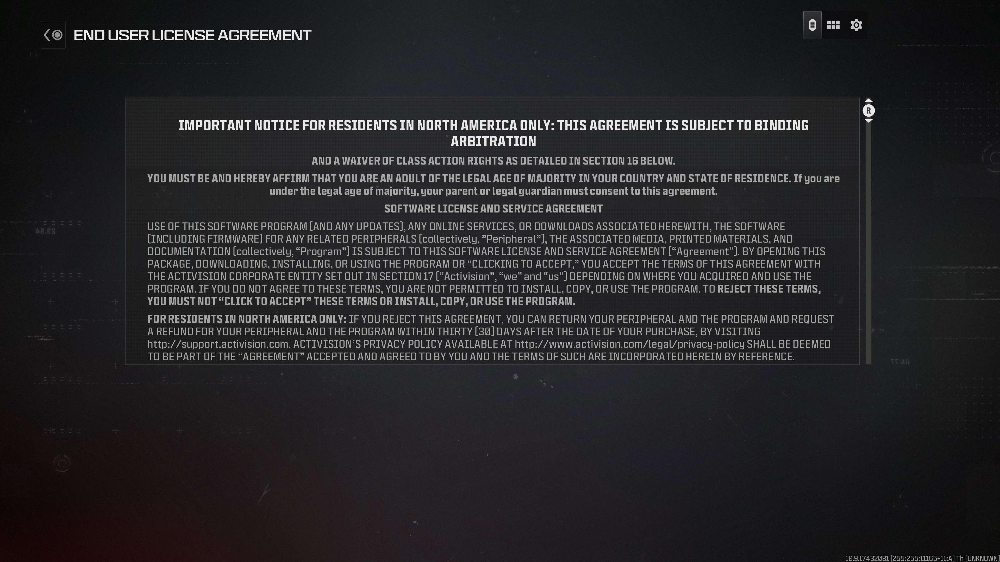

	

		# {frontmatter.title}
		<small>{frontmatter.subtitle}</small>
	

	
	
	<small>COD HQ, Message of the Day, built using React and SASS</small>
	
	I started working at Activision as a Mobile Engineer working on the Call of Duty Companion App which required a number of fixes to it's method of pulling from it's API endpoints for it's Friends List, building a new component for the Combat Record screen, and maintaining it's build process up until it was delisted in preference of MyCOD.
	
	
	
	<small>COD Companion App Combat Record</small> 
	

	<small>COD Companion App Combat Record</small>
	
	I was then brought onto Call of Duty: Modern Warfare 2. My team was in charge of developing on our browser based platform ‘Telescope’ used for live pages that wouldn’t require builds to be made for changes or additions that we’d make during production. This would make us able to operate without shipping our work to Infinity Ward's engineering to be included in console builds which is it's own timeframe and expense. This work included Terms of Service pages, Message of the Day, and Combat Record. Additionally, I helped build language binding with 18 languages using Hooks and Adobe Experience Manager as an endpoint that returned nouns for each language.
	
	
	<small>COD Companion App Combat Record</small>  
	
	<small>COD Companion App Combat Record</small>  
	■

  