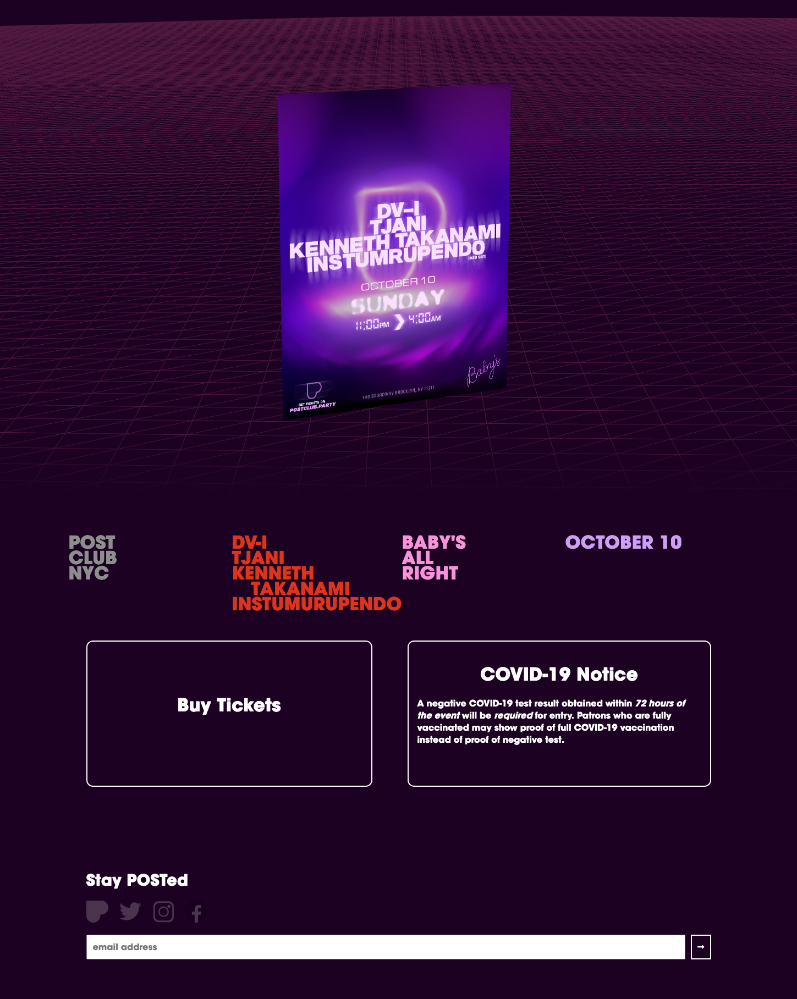

	

		# {frontmatter.title}
		<small>{frontmatter.subtitle}</small>
		<small>{frontmatter.tech}</small> 
		<small>{frontmatter.dateRange}</small>
	

	
	<small>postclub NYC website archive, built using Javascript and SASS</small>  
	In under a week, a customer facing website had to be made for a small series of live music events in Texas that lead to the purchase of their relative tickets. In under that week, me, Chelsea Park and the work of Simon Whybray for Supermodel figured out a design for these events. Using Javascript, three.js and node.js, a single page was able to be made that showcased this and provided a place for customers to be directed for tickets.
	
	Another event in New York months later was then made but maintained the same build process.

