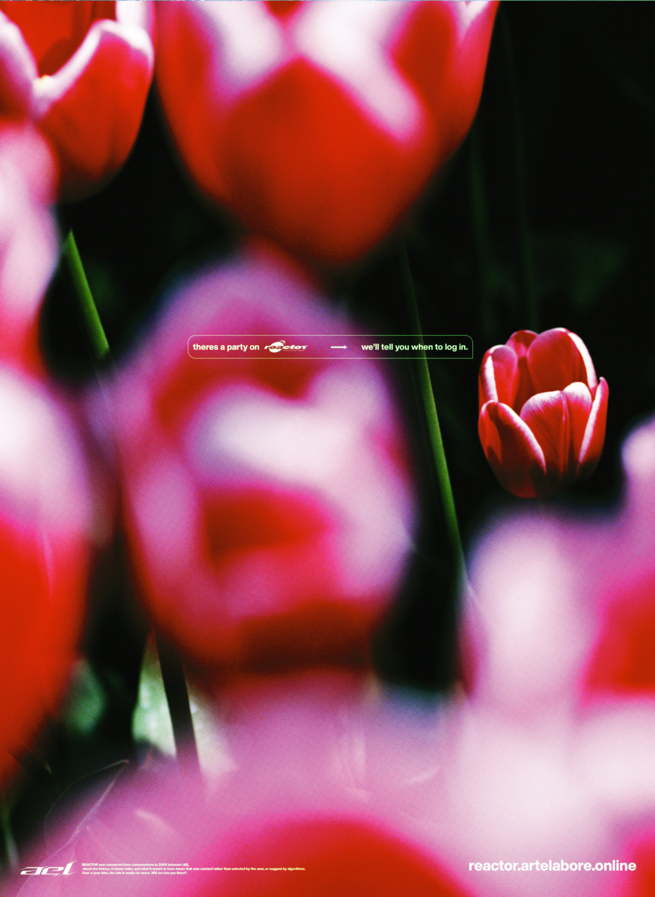

	

		# {frontmatter.title}
		<small>{frontmatter.subtitle}</small>
		<small>{frontmatter.tech}</small> 
		<small>{frontmatter.dateRange}</small>
	

	
	

	
	<small>Home page for Reactor V1</small>
	

	<a class="highlight-link" target="_blank" href="https://reactor.artelabore.online/">reactor.artelabore.online</a>
	
	
	Reactor is a collaboration with me and my friends at Arte Et Labore that begun after discussing about the frustrating state of 'internet cool'. Our interests ultimately bubbled down to an extremely stylized pirate radio station front end, where the back end would run on an Azuracast instance, and we'd hoist the lowest quality stream to the front end.
	
	Ultimately, the project is lead by me, but the contributions involve most of our design group. CSS and design code was handled by Aetherpoint and Ghost.Snacks while other visuals were produced by various members of Arte Et Labore, and we had ANTIREAL help out with the conversion to Typescript. Since then, we've hosted a solid, randomizing playlist of songs that fit the aesthetic that we were aiming for and additionally, many streams that were hosted physically and played to our radio server for everyone on the internet to hear live. 
	
	

	
	<small>Reactor v1 on the big screen, photo by Ghst.Snacks</small>
	

	
	You'll find key art for these events in this file.
	
	

	
	<small>Key art by arixant</small>
	

	

	
	<small>Key art by arixant</small>
	

	
 

