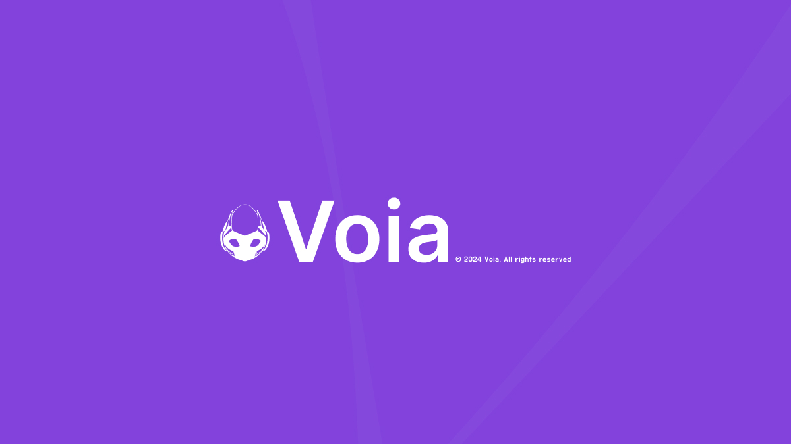
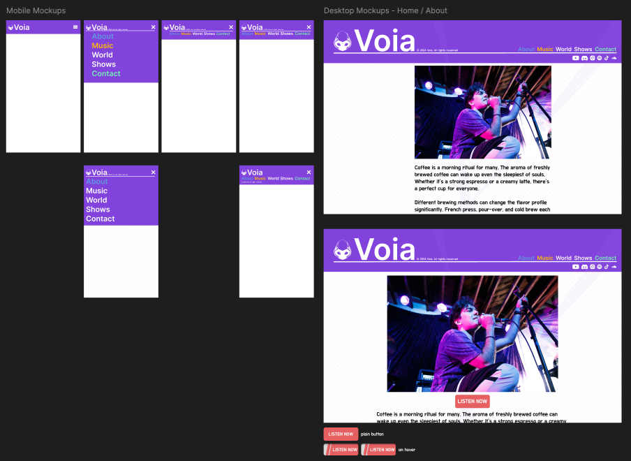
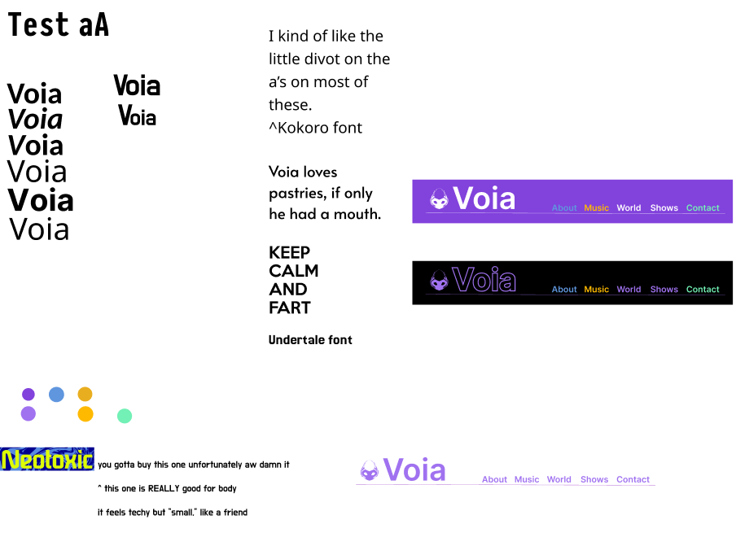
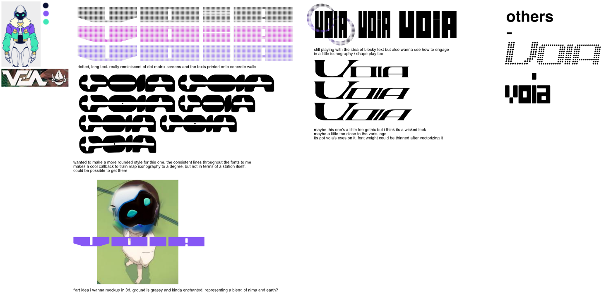

	

		# {frontmatter.title}
		<small>{frontmatter.tech}</small> 
		<small>{frontmatter.dateRange}</small>
	

	
	
	<small>Voia logo and color swatch</small>
	
	<a target="_blank" href="https://voiaisonline.com/">https://voiaisonline.com/</a>
	
	Chris Voia is a multifaceted artist who needed a solid way to present all of their work to their fans and future investors. Me and Voia initially kicked off to work on a rebranding project to help him get a consistent visual image that was more inline with a fantasy take on bustling transportation maps and urbanite living, but we decided that the most important thing would be to get him a custom blog, stylized in that same way to show at conventions he was being invited to.
	
	For this, I took on the project using Astro, which was useful for it's quick turnaround at building a fairly deep featured CMS system using Content Collections, and it's versatility in what frameworks are available to you for when Astro's client side components aren't enough for a feature or functionality, this being the Modal component which is built using React & SASS.
	
	
	<small>A small crop of the mockup for the layout</small>   
	
	<small>Second brainstorm session that we went on for the rebrand & website</small>  
	
	<small>The first brainstorm I had initially started - When it was for a rebrand</small>  
	
	You can view the source code to the project <a target="_blank" href="https://github.com/shagia/voia-website">here.</a> 

