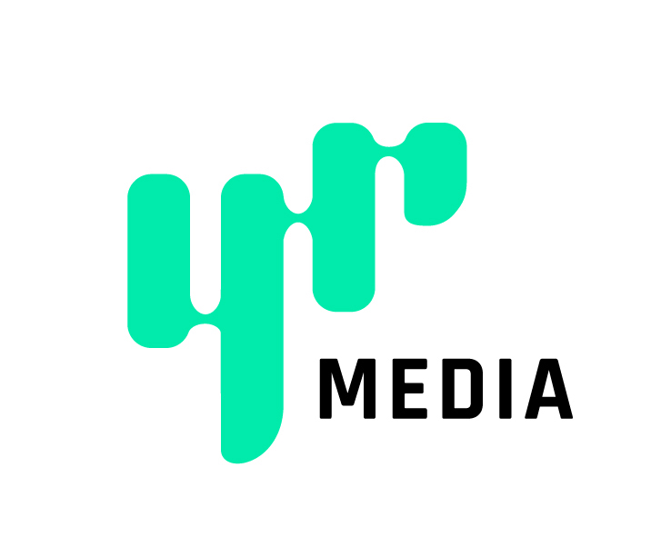

	

		# {frontmatter.title}
		<small>{frontmatter.subtitle}</small>
	

	
	
	<small>COD HQ, Message of the Day, built using React and SASS</small>
	
	My team was in charge of developing our browser based platform ‘Telescope’, used for live pages that wouldn’t require builds to be made for changes or additions that we’d make during production. This included Terms of Service pages, Message of the Day, and Combat Record. Additionally, I helped build language binding with 18 languages using Hooks and Adobe Experience Manager as an endpoint that returned nouns for each language.

