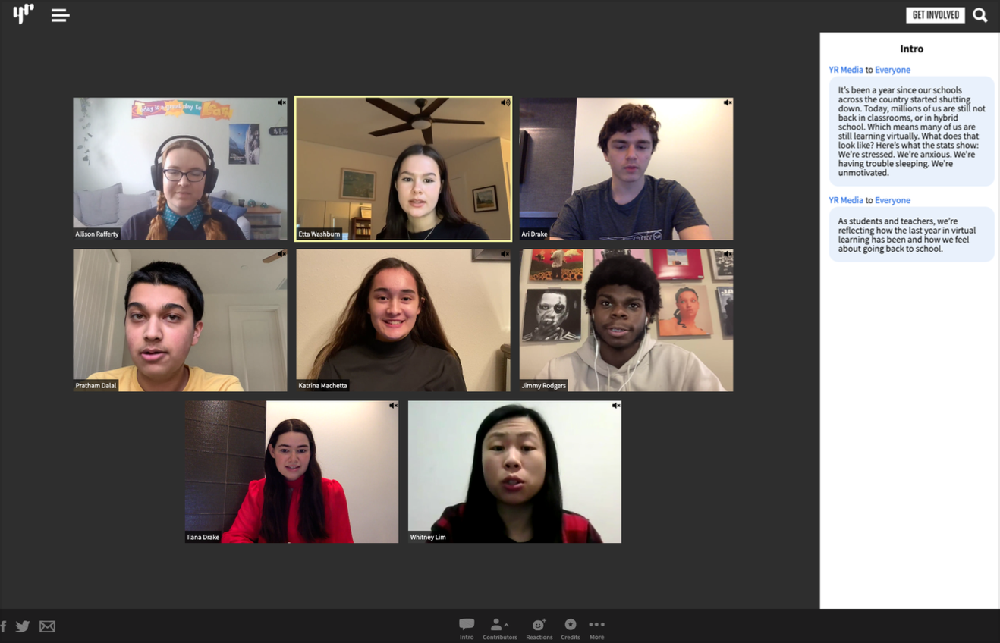

	

		# {frontmatter.title}
		<small>{frontmatter.subtitle}</small>
		<small>{frontmatter.tech}</small> 
		<small>{frontmatter.dateRange}</small>
	

	
	<small>YR Media logo</small>
	
	YR Media is a non profit media company that's dedicated to platforming teen and young adult voices nationwide regarding national issues, it was also one of my first jobs.
	
	My work there is a bit extensive: I was given the privilege of helping mentoring interns, building articles for our journalists, and helping assist and represent our MIT partnership in extending "App Inventor", a their drag and drop programming environment designed for introducing children to programming, and making appearances at their campus to represent us.
	
	
	<small>Zoomiversary, 2021, build using Vue and CSS Animations</small>
	
	Zoomiversary was a project documenting the experiences of young adults and teens going through the changes of on site work to remote a year after the lockdowns of COVID-19. This project was a collaboration built with Vue and CSS Animations.
	
	
	<small>Erase your Face, 2020, build using Vue</small>
	
	Erase your Face was a project coined by interns after a visit to The Glass Room in San Fransisco before COVID struck. Facial Recognition was a major takeaway amongst them and ultimately coined the idea of drawing over your face and using Amazon Rekognition to match similarity with the generated faces and others that may look similar.
	
	This was a project build using Vue and interfaced with our website’s Wordpress backend, featuring a drawing canvas that was developed by my coworker Radames Anja, whereas I helped with the UI and interface.
	
	
	<small>Coming of Age With Gun Violence, 2019, build using Vue</small>
	
	Coming of Age With Gun Violence was an archival project that documented the common instance where young teens and children find themselves amongst gun violence or the presence of weapons. This required a lot of digging in our archives for more context for the quotes we chose. Uses Vue and CSS animations.
	
	Unfortunately, much work seems to be missing due to their financial troubles.

