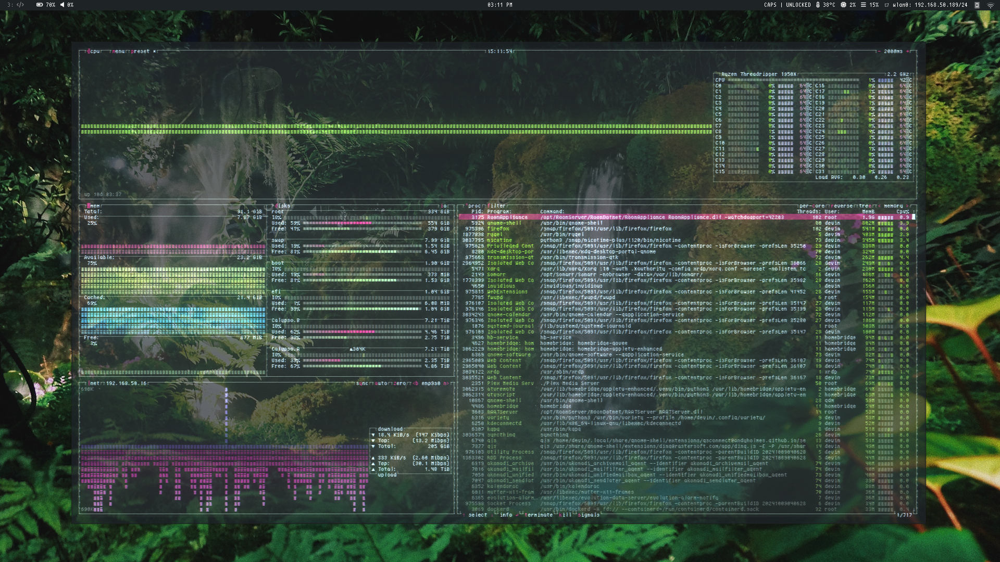

import AsciiContainer from "../../../components/Ascii";
import Logo from "./asciiEmblem.svg";
import { Image } from "astro:assets";

<AsciiContainer Logo={Logo} Specs={frontmatter.specs} client:load />

	

		# {frontmatter.title}
		<small>WorkstationServer</small>
	

	Originally a Hackintosh (check out <a target="_blank" class="highlight-link" href="https://dortania.github.io/OpenCore-Install-Guide">OpenCore</a>), this workstation turned server has helped me build tons of web, video, music and graphics projects since 2018, now half a decade ago. Originally, the CPU and Motherboard was sold as a bundle by a seller on Craigslist for pleasantly cheap. I asked if I could buy the motherboard first and come back a couple of weeks later to buy the CPU, he agreed.

    
    <small>Desktop, 2020</small>

    The rest of the components were my doing, which consisted of some not so great memory units, a decent Noctua fan, a HD 7870 gifted by a friend, some hard drives, and a power supply. It was the bare minimum to be running a 1950X with and the hard drives weren't helping, but the busiest workflows were now faster than I'd ever hope, and coming up with component upgrade after upgrade, this never really got old for me up until 2024 when I picked up a M2 Mac Mini.

    
    <small>After a deep cleaning and storage upgrade, 2025</small>

    For my current uses as a server it's very overkill, but I intend on this being my 'vault' by growing it for more i.e Development & VMs (Docker, Qemu, Git, Testing environments), AI usage (Ollama), content rendering (Cinema4D Team Renderer, Davinci Resolve), media streaming (Roon, Plex, Invidious, and Channels are all running simultaneously), game streaming (I need an output dongle), and archiving+backing up my own music and audio work (96k, 24bit) in ZFS while also uploading it to a cloud. Right now, it's not in the place it's supposed to be, but so wasn't it when I first picked it up:

    

    |    | Component | Details |
    | ------ | ------------ | --------------------------------------------- |
    | | CPU | AMD Threadripper 1950X @ 3.4GHz |
    | | GPU | AMD Radeon VII (currently disabled, headless) |
    | | RAM | 32GB DDR4 3200 |
    | | Motherboard | ASUS ROG Zenith Extreme Alpha |
    | | Storage | 4x WD80EFPX 8TB |
    | | NetworkingA | Aquantia AQC-107 @ 2.5Gbps, supports 10Gbps |
    | | NetworkingB | Intel® I211-AT (Disabled for now) |
    | | OS | Ubuntu |
    | | DE | Window Maker |
    

    
    <small>Today, via ssh - For the most part, idle</small>

    Ubuntu is my temporary flavor of choice here. Although I love AUR and rolling release software, the purpose of this server is ultimately sit it and forget it, and a rolling release just isn't suitable for this when accounting for the user intervention that's required there. At the end of the day in the future, FreeNAS or unRAID will be the winner.

    # Possible Changes
    * Ubuntu has been annoying, a switch to unRaid is still looked at
    * CPU upgrade? Cheap gen 2 Threadripper on eBay
    * Please get it in a server case and rack it
	* Underclock the CPU for low profile usage and cooling

